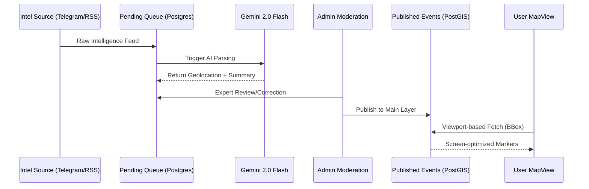

# OSINT Map System Architecture

This document explains the core technical architecture of the OSINT Map project.

> [!TIP]
> This architecture is designed for **sovereign hosting**. No external geospatial APIs (like Mapbox or Google Maps) are used for data storage or retrieval, ensuring maximum data privacy and cost control.

## 🏗️ 1. Geospatial Intelligence (GIS) Layer
Unlike typical map applications that handle coordinates as simple numbers, this system uses a professional-grade **GIS (Geospatial Information System)** approach.

- **Storage**: We use **PostgreSQL** with the **PostGIS** extension.
- **Data Type**: Locations are stored as `geometry(Point, 4326)`. This allows the database to understand the Earth's curvature (WGS84) and perform advanced spatial calculations.
- **Efficiency**: We use **R-Tree Indexing** to fetch markers only within the user's current viewport.

## 🔄 2. Data Flow: Viewport-First Ingestion
1. **Frontend**: The `MapView` component tracks the map's bounding box (BBox) as the user pans or zooms.
2. **API**: It requests markers from `/api/events` only for those specific coordinates.
3. **Database**: PostGIS uses `ST_Intersects` to "pluck" relevant events. This ensures the app remains fast even with millions of data points.

## 🤖 3. Intelligence Pipeline
The ingestion process is split into two stages:

1. **Staging (Pending Queue)**: Messy, raw data (Telegram, RSS) is saved to the `pending_events` table.
2. **AI Enrichment**: **Gemini-2.0-Flash** automatically parses the text to suggest a title, description, and exact coordinates.
3. **Moderation**: An administrator reviews the AI-suggested location in the **Intelligence Queue** and approves/edits it for publication.

## 🔐 4. Access Control
- **RBAC**: Role-Based Access Control is enforced via **Better-Auth**.
- **Roles**: 
  - `user`: Can view the map and feed.
  - `admin`: Can access the moderation queue, approve intel, and manage the system.

## 🗺️ 5. Sovereign Tile Hosting
The project is built for independence and cost-efficiency:
- **Tiles**: Served via `OpenFreeMap` (Bright style).
- **Engine**: `MapLibre GL` (Open-source alternative to Mapbox).
- **No Dependencies**: No paid proprietary APIs (Mapbox/Google) are required for core functionality.
