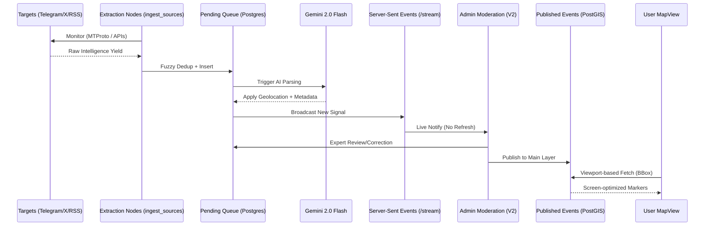

# OSINT Map System Architecture

This document explains the core technical architecture of the OSINT Map project.

> [!TIP]
> This architecture is designed for **sovereign hosting**. No external geospatial APIs (like Mapbox or Google Maps) are used for data storage or retrieval, ensuring maximum data privacy and cost control.

## 🏗️ 1. Geospatial Intelligence (GIS) Layer
Unlike typical map applications that handle coordinates as simple numbers, this system uses a professional-grade **GIS (Geospatial Information System)** approach.

- **Storage**: We use **PostgreSQL** with the **PostGIS** extension.
- **Data Type**: Locations are stored as `geometry(Point, 4326)`. This allows the database to understand the Earth's curvature (WGS84) and perform advanced spatial calculations.
- **Efficiency**: We use **R-Tree Indexing** to fetch markers only within the user's current viewport.

## 🔄 2. Data Flow: Spatial & Temporal Filtering
The map uses a **dual-filter** retrieval strategy:
1. **Spatial**: The `MapView` component tracks the BBox as the user pans/zooms.
2. **Temporal**: Users can filter messages by preset ranges (1H, 6H, 24H, 7D, 30D) or **custom start/end dates** (e.g., historical conflict periods).

The `/api/events` endpoint combines PostGIS `ST_Intersects` with standard SQL timestamp filtering for ultra-fast viewport-based range queries.

## 🛠️ 3. Tactical Response Hub (Admin V2)
The internal command center handles intelligence ingestion lifecycle dynamically:
- **Server-Sent Events (SSE)**: The UI auto-updates upon receiving new fully parsed intelligence directly from the backend stream (`/api/admin/stream`).
- **Extraction Nodes**: Admins manage raw sources via `/admin/sources`, enabling/disabling targeted Telegram/X handles without codebase modifications.
- **Fuzzy Deduplication**: The ingestor checks a 2-hour window of recent inputs to prevent duplicate processing of re-posted content.
- **Visual Intelligence**: Automated preservation of images and video thumbnails via Vercel Blob proxy, displayed directly in the queue.
- **Multi-AI Engine**: Fast real-time processing via **Gemini 2.0 Flash**.

## 🔐 4. Access Control
- **RBAC**: Role-Based Access Control is enforced via **Better-Auth**.
- **Roles**: 
  - `user`: Can view the map and feed.
  - `analyst`: Can view systemic logs and pending queues.
  - `moderator`: Can edit and authorize pending signals.
  - `admin/owner`: Complete system control (purge, unpublish, role administration).

## 🗺️ 5. Sovereign Tile Hosting
The project is built for independence and cost-efficiency:
- **Tiles**: Served via `OpenFreeMap` (Bright style).
- **Engine**: `MapLibre GL` (Open-source alternative to Mapbox).
- **No Dependencies**: No paid proprietary APIs (Mapbox/Google) are required for core functionality.

## 💻 6. Frontend State & Validation
The client-side architecture enforces strict boundaries between remote server state, local UI state, and data validation:
- **Zod Validation**: A single source of truth (`lib/schemas.ts`) ensures that all data entering the system—whether from an AI `ParsedIntel` response, an admin's UI editor, or an API call—is stringently validated for types, bounds, and enums BEFORE saving to the database.
- **TanStack Query (@tanstack/react-query)**: Manages all remote state (fetching from APIs). It auto-caches data, dedupes identical requests, and gracefully invalidates caches when mutations (like publishing an event) occur. SWR has been completely removed in favor of this robust asynchronous state manager.
- **Zustand (`useMapStore`, `useQueueStore`)**: Solves "prop drilling" and component bloat. Local presentation states (like map filters, moderation queues, and active forms) exist globally. Disparate components seamlessly sync without giant chained props.
