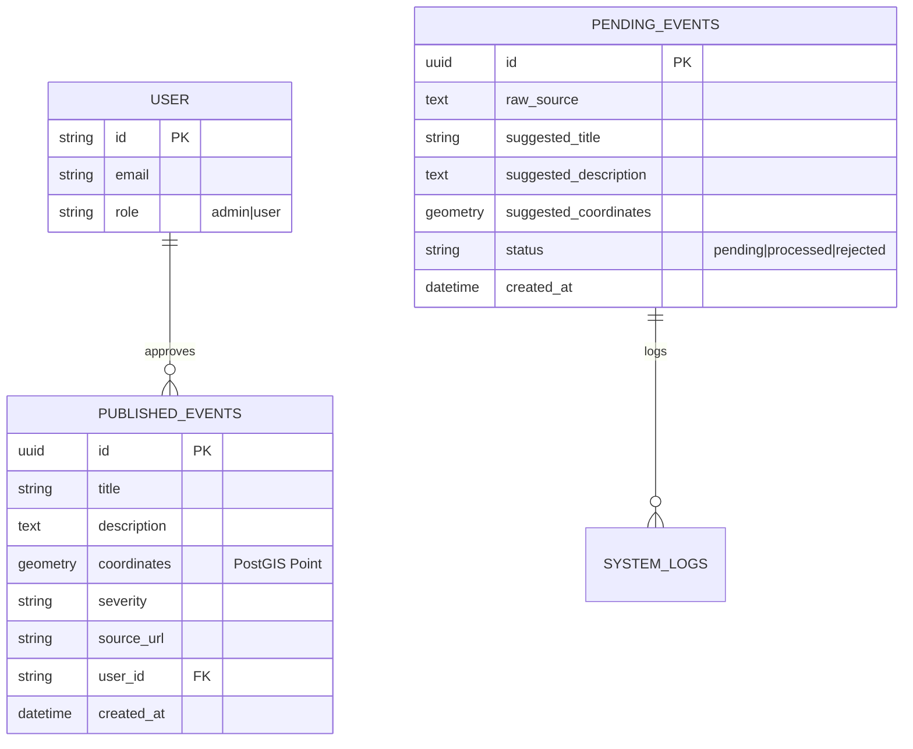

# Database Schema & GIS

This project leverages PostgreSQL with the **PostGIS** extension for advanced geospatial capabilities.

## 🗄️ Core Tables

### `published_events`
The source of truth for all live markers visible to the public.
- `id`: UUID (Primary Key)
- `title`: String
- `coordinates`: `geometry(Point, 4326)` (PostGIS Geometry)
- `severity`: Enum (`low`, `medium`, `high`, `critical`)
- `userId`: Reference to the user who approved the intel.

### `pending_events`
The staging area for raw incoming data.
- `raw_source`: The original text from Telegram/RSS.
- `suggested_coordinates`: AI-estimated geometry point.
- `status`: Enum (`pending`, `processed`, `rejected`).

### `user` (Auth)
- `email`: String (Unique)
- `role`: Enum (`user`, `admin`). This controls access to the moderation routes.

## 🔭 Key GIS Functions Used

### `ST_Intersects`
Used in `/api/events` to filter markers by the current viewport. High performance via spatial indexing.

### `pointSql` (Custom Helper)
Located in `lib/map-logic.ts`. Converts raw latitude/longitude floats into a PostGIS `geometry` format during database insertion.

### `ST_X` & `ST_Y`
Used in the API to convert geometry points back into latitude/longitude decimals so the browser can understand them.
