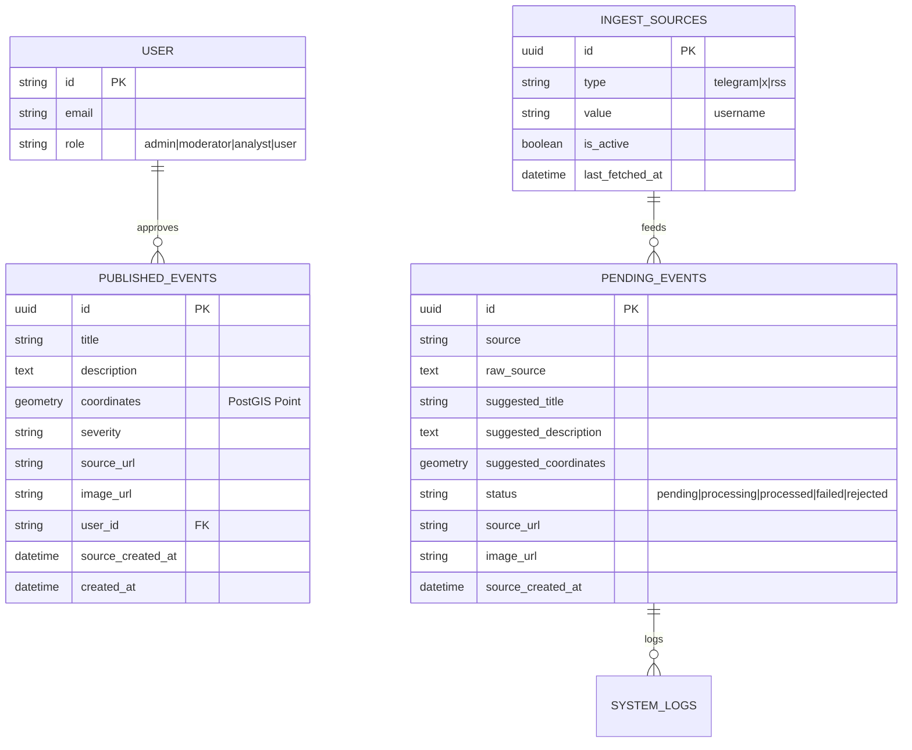

# Database Schema & GIS

This project leverages PostgreSQL with the **PostGIS** extension for advanced geospatial capabilities.

## 🗄️ Core Tables

### `published_events`
The source of truth for all live markers visible to the public.
- `id`: UUID (Primary Key)
- `title`: String
- `coordinates`: `geometry(Point, 4326)` (PostGIS Geometry)
- `severity`: Enum (`low`, `medium`, `high`, `critical`)
- `userId`: Reference to the user who approved the intel.
- `sourceUrl`: Persistent hyperlink to the original claim.
- `imageUrl`: Public link to visual evidence (Vercel Blob proxy).

### `pending_events`
The staging area for raw incoming data and geolocated AI payloads.
- `source`: The origin identifier (e.g., Telegram handle `osintdefender`)
- `raw_source`: The original text payload.
- `suggested_coordinates`: AI-estimated geometry point.
- `status`: Lifecycle hook (`pending`, `processing`, `processed`, `failed`, `rejected`).
- `sourceUrl` / `imageUrl`: Deep-links and visual proxies pulled simultaneously upon ingestion.

### `ingest_sources`
Registry configuration node for scraping targets.
- `type`: Target format (`telegram`, `x`, `rss`, `custom`).
- `value`: Target handle identifier.
- `isActive`: Maintenance kill-switch toggle for active scraping without payload loss.

### `user` (Auth)
- `email`: String (Unique)
- `role`: Enum (`admin`, `moderator`, `analyst`, `user`). This controls clearance bounds across the Administrative `/admin/*` routes.

## 🔭 Key GIS Functions Used

### `ST_Intersects`
Used in `/api/events` to filter markers by the current viewport. High performance via spatial indexing.

### `pointSql` (Custom Helper)
Located in `lib/map-logic.ts`. Converts raw latitude/longitude floats into a PostGIS `geometry` format during database insertion.

### `ST_X` & `ST_Y`
Used in the API to convert geometry points back into latitude/longitude decimals so the browser can understand them.
