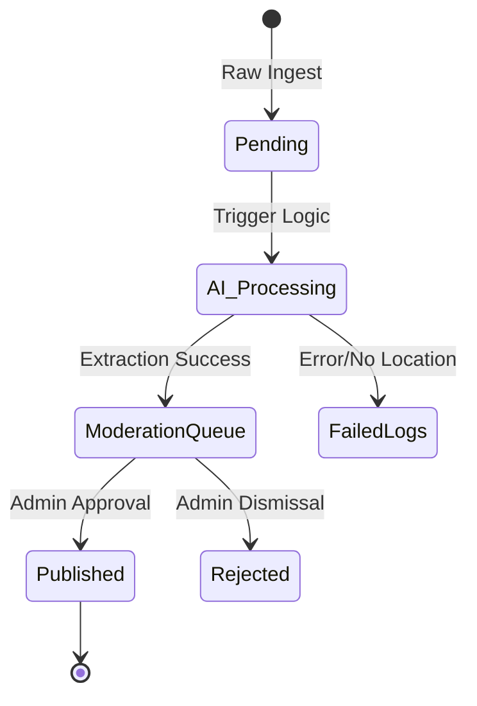

# Ingestion & AI Pipeline

How raw intelligence becomes geolocated markers on the map.



> [!IMPORTANT]
> The coordinates suggested by the AI are **guesses** based on semantic analysis. They must always be verified by an admin in the Moderation Queue before being committed to the public GIS layer.

## 📡 1. Multi-Source Target Ingestion
The system is designed to swallow raw, unstructured text from dynamic extraction nodes managed via the Admin Hub (`/admin/sources`):
- **Telegram Channels** (MTProto Scrapers)
- **X (Twitter)** (API / Playwright Scraper scaffolding)
- **REST/Manual API** (Staff manual entry)

Inputs hit the `.ingest_sources` registry. We pull the feeds constantly over long-polling or polling sockets.

### 🛡️ Cross-Source Fuzzy Deduplication
Before an event reaches the AI parser, it passes through 2 deduplication layers:
1. **Exact Matches**: Skips if the exact `externalId` (e.g. `tg_osintdefender_1048`) is already logged.
2. **Fuzzy Context Matches**: Scans the last 2 hours of signals using `pg_trgm` and basic word overlap scoring. If an incoming message shares >60% vocabulary with an existing event (e.g. from a different channel/X), it is skipped.

## 🧠 2. AI Parsing (Gemini-2.0-Flash)
The `lib/ai-parser.ts` module uses Google's Gemini models to perform "Named Entity Recognition" and "Geolocation".

- **Input**: *"Large explosion reported near the Okhmatdyt Children's Hospital in Kyiv."*
- **Process**: The AI identifies landmarks and cities, cross-references them internally, and returns a structured JSON.
- **Output**:
  ```json
  {
    "title": "Hospital Attack - Kyiv",
    "description": "Missile strike reported near hospital infrastructure. Urgent evacuation in progress.",
    "latitude": 50.4497,
    "longitude": 30.4854,
    "severity": "critical"
  }
  ```

## 🛠️ 3. The Moderation Queue & SSE Streams
Before an event is "Published" to the global map, it hits the Tactical Response Hub:
1. **Real-Time Delivery**: The command center is plugged directly into a **Server-Sent Events (SSE)** endpoint (`/api/admin/stream`). When the AI parser finishes a payload, the UI populates the new event instantly without a page refresh.
2. **Verification**: Admins see the raw text, visual evidence (if extracted), and source verification link next to the AI-suggested map pin.
3. **Adjustment**: Admins can correct the AI, drag the pin, or rewrite the title.
4. **Publication**: Once approved, the record transfers to the public PostGIS geometry table (`published_events`).

## 🚀 4. How to Test

### Mock Ingestion (Manual)
You can simulate the ingestion of any text using the mock-ingestor CLI:
```bash
pnpm tsx ingest/mock-ingestor.ts "Your raw intel text here"
```

### Telegram Ingestion (Real-time)
To start the live Telegram MTProto listener:
1. Ensure `TELEGRAM_API_ID` and `TELEGRAM_API_HASH` are in your `.env`.
2. Run:
```bash
pnpm start:ingest
```

### 🛡️ Reliability Features
The `ingest/telegram-ingestor.ts` is designed for **24/7 Production Stability**:
- **Heartbeat Monitoring**: Logs a "💓 Heartbeat" every 15 minutes to confirm the process is alive.
- **Auto-Reconnect**: Automatically detects silent connection drops and attempts to reconnect without crashing.
- **Rate Limit Throttling**: Includes a built-in 5-second delay between AI parsing tasks to respect Gemini API Free Tier quotas.
- **Stale Lock Cleanup**: Automatically clears its own PID lock file in cloud environments (Railway/Vercel) to ensure smooth restarts after a crash.

## 🖼️ 5. Media & Source Tracking
Every ingested signal includes automated source traceability:
- **Telegram Permalinks**: Each report persists a direct `t.me` link back to the original message.
- **Visual Intelligence**: The ingestor automatically extracts native photos and video thumbnails (for `Api.MessageMediaDocument`), uploads them to **Vercel Blob Storage**, and attaches the URL to the report.

## ⏳ 6. Historical Backfilling
The `telegram-ingestor.ts` includes logic to crawl backwards in time when a new channel is added. 
- It scans the last **100 messages** of any new source to ensure the map isn't empty on day one.
- Historical messages follow the same AI enrichment and moderation pipeline as live signals.
