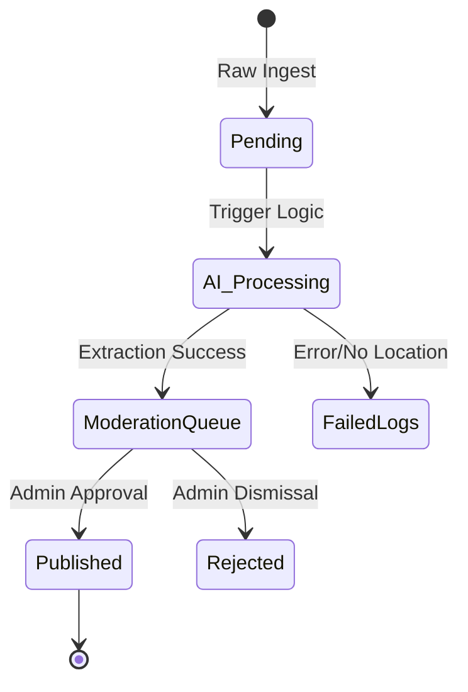

# Ingestion & AI Pipeline

How raw intelligence becomes geolocated markers on the map.



> [!IMPORTANT]
> The coordinates suggested by the AI are **guesses** based on semantic analysis. They must always be verified by an admin in the Moderation Queue before being committed to the public GIS layer.

## 📡 1. Raw Ingestion
The system is designed to swallow raw, unstructured text from various sources:
- **Telegram Channels** (MTProto Scrapers)
- **RSS Feeds**
- **Manual Input**

Inputs are hit first in the `Pending Queue`, preserving the original raw text/source.

## 🧠 2. AI Parsing (Gemini-2.0-Flash)
The `lib/ai-parser.ts` module uses Google's Gemini models to perform "Named Entity Recognition" and "Geolocation".

- **Input**: *"Large explosion reported near the Okhmatdyt Children's Hospital in Kyiv."*
- **Process**: The AI identifies landmarks and cities, cross-references them internally, and returns a structured JSON.
- **Output**:
  ```json
  {
    "title": "Hospital Attack - Kyiv",
    "description": "Missile strike reported near hospital infrastructure. Urgent evacuation in progress.",
    "latitude": 50.4497,
    "longitude": 30.4854,
    "severity": "critical"
  }
  ```

## 🛠️ 3. The Moderation Queue
Before an event is "Published" to the global map, it must pass a human check:
1. **Verification**: Admins see the raw text alongside the AI-suggested location.
2. **Adjustment**: If the AI is slightly off, admins can click the map to re-pin the target.
3. **Publication**: Once approved, the record is moved from `pending_events` to `published_events` and PostGIS geometry is generated.

## 🚀 4. How to Test

### Mock Ingestion (Manual)
You can simulate the ingestion of any text using the mock-ingestor CLI:
```bash
pnpm tsx ingest/mock-ingestor.ts "Your raw intel text here"
```

### Telegram Ingestion (Real-time)
To start the live Telegram MTProto listener:
1. Ensure `TELEGRAM_API_ID` and `TELEGRAM_API_HASH` are in your `.env`.
2. Run:
```bash
pnpm tsx ingest/telegram-ingestor.ts
```
3. Follow the CLI prompts to log in.
4. Copy the **Session String** printed in the terminal and save it to `TELEGRAM_SESSION` in your `.env` so you don't have to log in every time.
